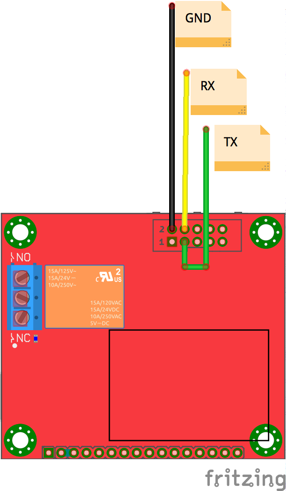

# How to upload a new sketch
In order to upload a new sketch on the Olimex ESP8266-Dev, you need an USB to Serial converter.  
• Connect **GND/TX/RX** of the converter to the ones of the Olimex board as illustrated in the image below.  
• Then, just before supplying power to the board press the button.  
• Now you can upload a new sketch  

